# OpenID4VP - Online Sharing

The Inji Wallet supports OpenID4VP specification draft 21 and draft 23. This document provides a comprehensive overview of the process of sending a Verifiable Presentation to Verifiers who request them online. It adheres to the OpenID4VP [draft 21 specification](https://openid.net/specs/openid-4-verifiable-presentations-1_0-21.html) and [draft 23 specification](https://openid.net/specs/openid-4-verifiable-presentations-1_0-23.html) which outlines the standards for
requesting and presenting Verifiable Credentials.

## Overview

- The implementation follows OpenID for Verifiable Presentations Specification.

- Below are the fields we expect in the Authorization Request:

  - client_id
  - client_id_scheme (Optional | Default value : pre-registered) [For Draft 21]
  - presentation_definition/presentation_definition_uri
  - response_type
  - response_mode (direct_post and direct_post.jwt)
  - nonce (Optional)
  - state
  - response_uri
  - client_metadata (Optional)

  The specification also allows the Verifier to send Authorization Request by reference. It uses the parameters `request_uri` and `request_uri_method` (Optional) to send the authorization request as a URL reference. This can help reduce the size of the QR code and improve security by not exposing sensitive information.

  **Note** : Sharing **_wallet metadata_** is supported as part of this version. It can be shared to the verifier when the verifier sends Authorization request by reference and `request_uri_method` is **POST**.

  - When request_uri is passed as part of the authorization request parameters, below are the expected fields:

    - client_id
    - client_id_scheme [For Draft 21]
    - request_uri
    - request_uri_method (Optional | Default value : get)

  - Sequence Diagram - Obtain Authorization Request by Reference

  ```mermaid
  sequenceDiagram
    participant 🌐 Verifier
    participant Inji_Wallet as 📱Inji Wallet
    participant 🙋 User

    Verifier->>User: 1. Display Authorization Request as QR Code
    User-->>Verifier: 2. Scan QR Code via Inji Wallet
    Inji_Wallet->>Inji_Wallet: 3. Extract parameters from QR Code and<br/> validate the parameters
    Inji_Wallet->>Verifier: 4. Send request to request_uri
    Verifier->>Inji_Wallet: 5. Return Authorization Request Object
  ```

The implementation of this feature involves the following steps:

1. The Verifier displays the Authorization Request to the End-User as a QR Code with parameters like `client_id`, `request_uri` and optionally `request_uri_method`, `client_id_scheme`.
2. The Wallet scans the QR Code and extracts the parameters and validates the parameters in the request.
   - In case of `client_id_scheme` being `pre_registered`, the Wallet also checks if the `client_id` and `request_uri` is available with its trusted Verifiers list for privacy considerations.
   - For other schemes, the usual validation is done based on the `client_id_scheme` and the `client_id` value.
3. The Wallet then sends a request to the Verifier's `request_uri` value that is provided in the QR Code.
4. The Verifier processes the request and returns the Authorization request object as jwt.
5. Once the Wallet receives the Authorization Request Object, it extracts the object and first validates the request by performing the following checks
   - The `client_id` and `client_id_scheme` values in the Authorization Request (QR code parameters) and Authorization Request Object (`request_uri` response) are identical, if not the process is terminated
6. After this extraction and initial check, the Wallet then proceeds with the next steps of validation and processing as per the `client_id_scheme`.

**Note** : The pre-registered client id scheme validation can be toggled on/off based on the optional boolean which you can pass to the authenticateVerifier method's shouldValidateClient parameter. This is false by default.

## Client Id Scheme Supported

- Below are the supported Client Id Scheme by the library:

  - **pre-registered** : This client id scheme suggests that the verifier is already registered with the wallet and the trust is already established. The request must be signed when shared by reference.

  - **redirect-uri**: When the Client Identifier Scheme is `redirect_uri`, it specifies that the client id is Verifier's Response URI . In this case, the Authorization Request must not be signed

  - **did** : When the Client Identifier Scheme is `did`(Decentralized Identifier), client id must follow the `did:` URI format without additional prefixes. The request must be signed with a private key linked to the DID, and the corresponding public key must be retrieved from the DID Document via DID Resolution. The specific key used must be identified using the kid in the JOSE header. All other Verifier metadata must be provided through the client_metadata parameter.

## Verifiable Credential Format Supported for Sharing:

- ldp_vc
- mso_mdoc
- vc+sd-jwt
- dc+sd-jwt

## Functionalities

##### Authorization Request handling:

- The Verifier will generate a QR code with authorization request.
- Wallet scans the QR code to get the Authorization request and sends the authorization request to the library along with the trusted verifiers and boolean to validate the client.
- Library decodes and parse the Verifier's encoded Authorization Request received from the Wallet.
  <br>**Note** : When request_uri is present in the request, the actual authorization request is retrieved by making a request to the request_uri.
- Authenticates the Verifier based on the client id scheme in the Authorization request and return the valid Authorization request to the wallet.
  <br>**Note** : Only when the client id scheme is pre-registered the validation can be toggled on/off based on the boolean.

##### Credential selection and sending response:

- Wallet reads the authorization request and sends the list of matching verifiable credentials to the library.
- Library receives the list of verifiable credentials(VC's) from the Wallet which are selected by the end user based on the claims requested.
- Constructs the unsigned verifiable presentation token data and send it to wallet for generating signature.
- Wallet signs on the unsigned verifiable presentation token data and sends the signature along with other details to the library.
- Library receives the signature and create response data and sends a POST request with generated vp_token and presentation_submission to the Verifier response_uri endpoint.

```mermaid
sequenceDiagram
  participant VP as 🌐 Verifier
  participant W as 📱 Wallet
  participant Lib as 🔐📄 OpenId4VP Library

  Note over VP: Generate QR Code with<br/>Authorization Request
  W ->> VP: Scan QR Code and get<br/>Authorization Request
  W ->> Lib: Forward Authorization Request<br/>(authenticateVerifier api)

  Note over Lib: Validates Request based on client id scheme
  Note over Lib: Validate Required Fields<br/>and Values
  Lib-->>W: Return Validated Authorization Request


  Note over W: Process Authorization Request<br/>and Display Matching VCs

  W->>Lib: Send Selected VCs with User Consent<br/>(constructUnsignedVPToken api)
  Note over Lib: Construct unsigned VP Token for each vc format
  Note over Lib: Construct Proof Object without Signature
  Note over Lib: Attach Proof to unsigned VP Token
  Lib-->>W: Return unsigned VP Token mapped with vc format

  Note over W: For ldp_vc format, create detached JWT<br/>by signing the data
  Note over W: For mso_mdoc format, create signature<br/>by signed the data
  Note over W: For vc+sd-jwt/dc+sd-jwt format, create signature<br/>by signing key binding data if required
  W->>Lib: Send signed data<br/>(shareVerifiablePresentation api)


  Lib->>VP: HTTP POST Request with:<br/>1. VP Token<br/>2. Presentation Submission<br/>3. State
```



**Note:** 
Holder binding support - The holder binding is a feature that allows the Verifier to ensure that the Verifiable Presentation is being presented by the same holder that holds the Verifiable Credentials.
* for ldp_vc format
  * Supported for VCs signed with signature suite **_Ed25519Signature2020_**.
* for vc+sd-jwt and dc+sd-jwt format
  * Via [cnf](https://www.ietf.org/archive/id/draft-ietf-oauth-sd-jwt-vc-10.html#section-3.2.2.2-3.4.2.1) claim and supported for `kid` only
  * Supported algorithms - **_ES256_**, **_Ed25519_**.