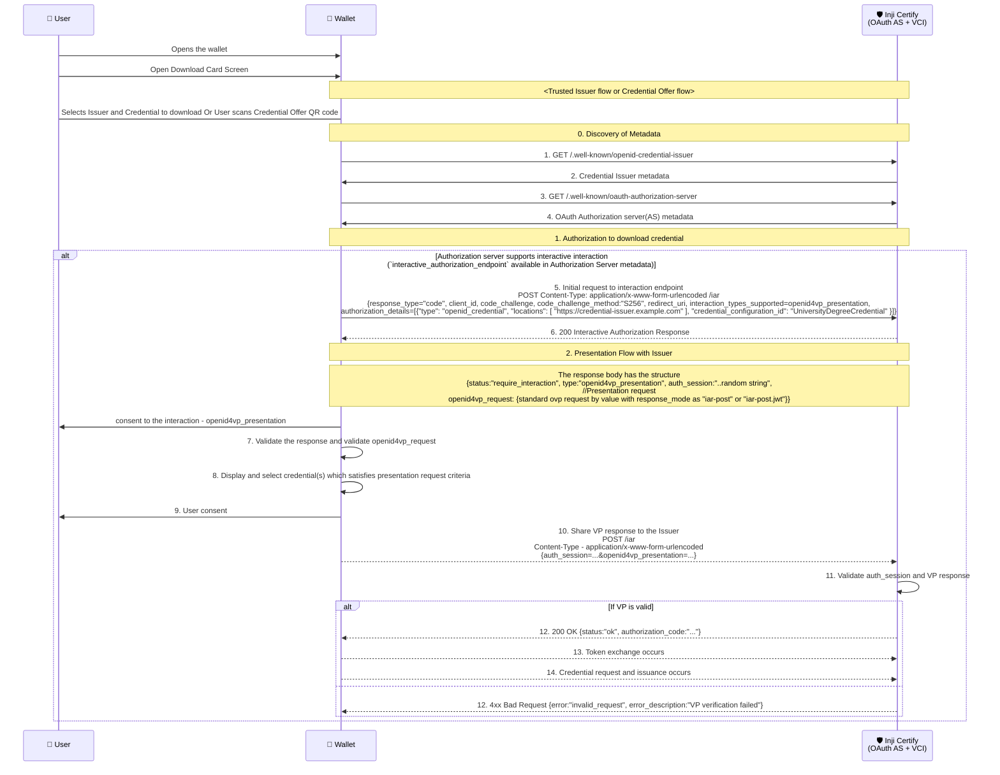
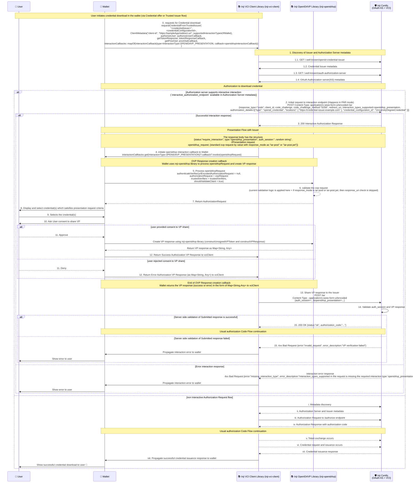

# Presentation During Issuance

When issuing credentials to a user, authentication or authorization is often required. The most common factor used is an OTP. However, using OTPs means the user must recall their identifier each time they access their credential. To simplify this, the specification allows submitting an existing credential to authorize the user for credential issuance — a process known as Presentation during Issuance.
In essence, it means presenting one credential to obtain another.

Example use cases:

- To issue a Student ID Credential, the user presents an Enrollment Credential issued by the educational institution.
- To issue a Health Insurance Credential, the user presents an Identity Credential issued by a government authority.

This document focuses on the tech design to support presentations during the issuance process, particularly in scenarios where the issuer requires a presentation to be made before issuing a credential.

## Clarifications

- The OVP request received is no different from current OVP request structure followed in Wallet (Draft 23 OpenID4VP specification using DIF presentation exchange). // TODO: add as hyper link
- The VP response created is also similar to the current VP response structure followed in Wallet (Draft 23 OpenID4VP specification using DIF presentation exchange).
- Wallet supports for `openid4vp_presentation` interaction type only. Other interaction types like `redirect_to_web` will be supported in future.

### Future scope

- redirect_to_web interaction type support during issuance.

## Pre-requisites

- The Issuer supporting the Interactive Authorization Request Endpoint as per the specification.

## Overall Flow diagram

### Actors involved

1. **User**: The individual requesting the credential.
2. **Wallet - Inji Wallet**: The digital wallet application used by the user to manage credentials.
3. **Issuer - Inji Certify (OAuth AS + VCI)**: The entity responsible for issuing the credential, which also acts as an OAuth Authorization Server and Verifiable Credential Issuer.

### Sequence of interactions between entities

## Sequence of interactions between entities via inji-\* Libraries

### Actors involved

1. **User**: The individual requesting the credential.
2. **Wallet - Inji Wallet**: The digital wallet application used by the user to manage credentials.
3. **Issuer - Inji Certify (OAuth AS + VCI)**: The entity responsible for issuing the credential, which also acts as an OAuth Authorization Server and Verifiable Credential Issuer.
4. **Inji VCI Client Library**: The library used by the wallet to handle OpenID for VC issuance.
5. **Inji OpenID4VP Library**: The library used by the wallet to handle OpenID for Verifiable Presentations.

#### Notes

- In Step 0, why is it interactionCallbacks rather than just presentationRequestCallback?
  - Because in the future, there can be other interaction types (eg - `redirect_to_web` or any custom interaction) supported during issuance as well. Hence, to keep it extensible, we have designed it this way.
- In Step 4, why is ovp request validation or any other processing propogated to Wallet rather than being handled in inji-openid4vp library?
  - Because the Wallet is responsible for user interactions, including displaying requests and obtaining user consent. Hence, the Wallet needs to validate the request and process it accordingly.
  - This also allows the Wallet to have control over how it wants to handle the presentation request and which library to use for VP response creation.
- In step 5, why is authenticateVerifier called with urlEncodedAuthorizationRequest = null and authorizationRequest = ovpRequest?
  - Because in this flow, the openid4vp request is received by value (not as a URL). Hence, we pass it as authorizationRequest.
- In step 6, why is there a special validation for response_mode?
  - Because in this flow, the response_mode can be `iar-post` or `iar-post.jwt`, which are specific to interactive authorization requests.
  - Hence, we need to skip the response_uri check for these modes as ovp_request may not contain response_uri in such cases and response is sent to the interaction endpoint of the issuer.
- In step 11, why is method `constructVPResponse` used rather than `sendAuthorizationResponseToVerifier`?
  - Because in this flow, the VP response needs to be sent to the Issuer (/iar) which is known to vci client library.
  - The method `sendAuthorizationResponseToVerifier` is designed to send the VP response directly to the verifier endpoint, which is not applicable in this case.
  - check below point for more clarity on why vci-client needs only the OVP response.
- In Step 13, why is vci client library responsible for sharing VP response to issuer rather than inji-openid4vp library?
  - Because the vci client library is responsible for handling the overall issuance flow, including interactions with the issuer.
  - The inji-openid4vp library is focused on handling OpenID for Verifiable Presentations, including creating VP responses, but not managing the entire issuance process.
  - Also There is a mandation to add authSession to the request which is specific to issuance flow and not related to openid4vp.
  - The VP response submission body of OVP flow - {vp_token:..., presentation_submission:...} is wrapped inside but in PDI flow {auth_session:..., openid4vp_presentation:{vp_token:..., presentation_submission:...}} it differs. To handle this wrapping and addition of auth_session, it is better to keep this logic in vci client library.

#### Changes summary

1. Inji VCI Client Library
   - Add support for client metadata to accept supported interaction types of Wallet. (interactionTypesSupported field)
   - Update requestCredentialFromTrustedIssuer and requestCredentialFromOffer methods to accept interactionCallbacks map to handle different interaction types during issuance.
   - Implement logic to handle openid4vp_presentation interaction type, including invoking the appropriate callback in the Wallet.
   - Add logic to share VP response to Issuer's /iar endpoint after receiving it from Wallet.
2. Inji OpenID4VP Library
   - Add support to validate openid4vp request with response_mode as iar-post or iar-post.jwt by skipping response_uri check.
   - Add support to create VP response for openid4vp request with response_mode as iar-post or iar-post.jwt.
3. Inji Wallet

- Implement the openid4vp interaction callback to handle the presentation request, display it to the user, and obtain user consent.
- Use inji-openid4vp library to process the openid4vp request and create the VP response.
- Handle error scenarios and propagate errors to the user appropriately.
- Integrate with the updated inji-vci-client library to support the new interaction flow during credential issuance.

## References

- [OpenID for Verifiable Credentials Issuance 1.1 - Interactive Authorization Request Endpoint](https://openid.github.io/OpenID4VCI/openid-4-verifiable-credential-issuance-1_1-wg-draft.html#name-interactive-authorization-e)
- [OpenID for Verifiable Presentations - Draft 23](https://openid.github.io/openid4vp/draft-23.html)
- [RFC 9126 - Pushed Authorization Requests (PAR)](https://datatracker.ietf.org/doc/html/rfc9126)
- [Spike card](https://mosip.atlassian.net/browse/INJIMOB-3601)
