## OpenId4VP support for IETF SD-JWT credential formats (vc+sd-jwt and dc+sd-jwt)

This document provides a comprehensive overview of the process for presenting sd-jwt credential to Verifier(relying party), adhering to the OpenId4VP specification.

This feature is applicable for both the flows

- Cross device flow
  - User scans QR code on wallet app to retrieve authorization request from verifier
- Same device flow
  - There are 2 ways to achieve deep link navigation
    - User opens the verifier on Mobile and clicks on the QR code generated by verifier to retrieve authorization request
    - User receives authorization request as a link through some notification with custom uri `openid4vp://`. User clicks on link and gets navigated to Wallet App.

### Actors involved

1. User
2. Inji Wallet
3. inji-openid4vp\_ (Library for processing OVP request)
4. Verifier (Relying Party)

### Sequence diagram - Present sd-jwt credential to Verifier (Relying Party)

```mermaid
sequenceDiagram
  autonumber
  participant User as 🙋 User
  participant Wallet as  📱 Inji Wallet
  participant OVP_Lib as 🔐📄 Inji OpenId4VP (Library)
  participant RP as 🌐 Verifier (Relying Party)

  Note over RP: Prepare Authorization Request
  RP-->>Wallet: Share Authorization Request as QR Code or Deep Link
  User->>Wallet: Scan QR Code or Click on Tap Deep Link
  Wallet->>OVP_Lib: Forward authorization request
  Note over OVP_Lib: Validate authorization request
  OVP_Lib-->>Wallet: Return validated authorization request
  Note over Wallet: Process Authorization Request and Filter matching credentials based on requested claims
  Wallet-->>User: Display matching credentials to user for selection
  User->>Wallet: User selects credential(s)
  Wallet->>OVP_Lib: Pass user's selected credentials after face verification if needed
  Note over OVP_Lib: Validate and prepare for VP creation
  OVP_Lib->>OVP_Lib: Check if Holder key binding possible<br/>`cnf` attribute in VC
  alt Holder key binding available(`cnf` exists)
    OVP_Lib->>OVP_Lib: Prepare key binding details for signing
    OVP_Lib-->>Wallet: Return header and payload to create signature for Key binding
    Wallet->>Wallet: Create signature for Key binding
    Wallet->>OVP_Lib: Share signature for Key binding
    OVP_Lib->>OVP_Lib: Attach signature to VP Token
    OVP_Lib->>RP: Submit VP Token with key binding
  else Holder key binding not available(`cnf` is missing)
    OVP_Lib->>OVP_Lib: Prepare VP Token<br/>(No key binding required)
    OVP_Lib-->>Wallet: Indicate no key binding required
    Wallet->>OVP_Lib: Return the data without signature
    OVP_Lib->>RP: Submit VP Token without key binding
  end

```



#### Steps involved

##### 1. Share Authorization Request as QR Code

The Verifier prepares an authorization request and shares it with the Wallet in the form of a QR code by value or by reference.

##### 2. Scan QR Code

User scans the QR code using the Wallet application to retrieve the authorization request.

##### 3. Forward authorization request

The Wallet forwards the scanned authorization request to the _inji-openid4vp_ library for processing and validation.

```
OpenId4VP.authenticateVerifier(
    urlEncodedAuthorizationRequest,
    trustedVerifiers,
    shouldValidateClient
)

Note:
- urlEncodedAuthorizationRequest is base64 url encoded authorization request received from Verifier.
- trustedVerifiers is list of trusted Verifier known to wallet.
- shouldValidateClient is boolean to indicate whether to validate client or not if client-id-scheme is pre-registered.

```

##### 4. Return validated authorization request

The _inji-openid4vp_ library validates the authorization request and returns the validated request to the Wallet.

##### 5. Display matching credentials to user for selection

The Wallet processes the authorization request and filters the credentials that match the requested claims.
It then displays these matching credentials to the user for selection.

##### 6. User selects credential(s)

The user selects one or more credentials from the displayed list in the Wallet application.

##### 7. Pass user's selected credentials after face verification if needed

If any of the selected VCs has face/picture, the wallet asks user to perform face verification before passing the selected credentials to the _inji-openid4vp_ library.

```
OpenId4VP.constructUnsignedVPToken(
    selectedVCs,
    holderId,
    signatureAlgorithm
)

Note:
- selectedVCs is list of user selected VCs to be presented to Verifier. It is a map of credential format and credential data w.r.t input descriptor
- holderId is unique identifier for the holder. It can be DID or public key thumbprint.
- signatureSuite is signature algorithm to be used for signing VP Token. This is needed for ldp_vc format only. It's JsonWebSignature2020 as we are supporting only Ed25519Signature2020
  - For the SD-JWT format,, this field is ignored because the signature algorithm is determined from the `cnf` claim

```

##### 8. Check if Holder key binding possible and prepare VP token

The _inji-openid4vp_ library validates the selected credentials and check if key binding possible or not.
If `cnf` claim exists, it is considered that key binding is possible, otherwise not possible.

##### 9. Prepare key binding details for signing

The _inji-openid4vp_ library creates the unsigned VP Token data and prepares the key binding details for signing.

##### 10. Return header and payload to create signature for Key binding

The _inji-openid4vp_ library returns header and payload as unsignedVPToken to create signature.

```
It returns a map of credential format and unsigned VP Token data to the Wallet to create signature

for vc+sd-jwt and dc+sd-jwt format
{
    "vc+sd-jwt": {
        "uuid": "<header>.<payload>"
    },
    "dc+sd-jwt": {
       "uuid": "<header>.<payload>"
    }
}

Note:
- It returns header and payload to create signature for Key binding.
  - uuid is being used to map the signature returned from wallet to the respective sd-jwt vc
```

##### 11. Create signature for Key binding

The Wallet creates a signature for key binding using the provided header and payload for each sd-jwt format credential.
It extracts `alg` from the provided header and use that algorithm to create signature.

##### 12. Share signature for Key binding

The wallet shares key binding signature with the _inji-openid4vp_ library.

##### 13. Attach signature to VP Token

The _inji-openid4vp_ library attaches the signature to already created unsigned vp token.

##### 14. Submit VP Token with key binding

The _inji-openid4vp_ library submits the VP Token with key binding to the Verifier(relying party) as per Authorization request response mode.

##### 15. Prepare VP Token without key binding

The _inji-openid4vp_ library create vp token without key binding details.

##### 16. Indicate no key binding required

The _inji-openid4vp_ library creates the unsigned VP Token data without key binding details.

```
It returns a empty map of credential format because key binding is not required.

for vc+sd-jwt and dc+sd-jwt format
{
    "vc+sd-jwt": {},
    "dc+sd-jwt": {}
}

```

##### 17. Return the data without signature

The wallet does not create the signature and return the data as is.

##### 18. Submit VP Token without key binding

The _inji-openid4vp_ library submits the VP Token without key binding to the Verifier(relying party) as per Authorization request response mode.
